# 📚 Syllabus Document Management System

## Overview
System for managing teaching materials (tài liệu giảng dạy) associated with syllabuses. Lecturers can upload PDF, Word, PowerPoint, and Excel files that are versioned and tracked alongside syllabuses.

## Features

### ✅ Implemented Features

#### 1. Document Upload
- **Primary Format**: PDF (recommended)
- **Optional Formats**: Word (.docx, .doc), PowerPoint (.pptx, .ppt), Excel (.xlsx, .xls)
- **File Size Limit**: 50MB per file
- **Version Tracking**: Each document is linked to a specific syllabus version
- **Metadata**: Original filename, file type, size, upload timestamp, description

#### 2. Document Management
- **List Documents**: View all documents for a syllabus
- **Download**: Download original files
- **Delete**: Soft delete for draft documents
- **Statistics**: Track total documents and storage usage per syllabus

#### 3. Status Workflow
- **DRAFT**: Initial upload, can be deleted/modified
- **APPROVED**: Document approved when syllabus is approved (cannot delete)

## Database Schema

### Table: `syllabus_documents`

```sql
CREATE TABLE syllabus_documents (
    id UUID PRIMARY KEY,
    syllabus_id UUID NOT NULL,
    file_name VARCHAR(255) NOT NULL,          -- Unique stored filename
    original_name VARCHAR(255) NOT NULL,       -- User's original filename
    file_type VARCHAR(20) NOT NULL,            -- PDF, DOCX, etc.
    file_size BIGINT NOT NULL,                 -- Bytes
    file_path VARCHAR(500) NOT NULL,           -- Storage path
    mime_type VARCHAR(100),
    uploaded_by VARCHAR(100) NOT NULL,         -- Lecturer username
    syllabus_version INTEGER NOT NULL,         -- Links to syllabus version
    status VARCHAR(20) NOT NULL,               -- DRAFT or APPROVED
    description TEXT,
    uploaded_at TIMESTAMP NOT NULL,
    updated_at TIMESTAMP NOT NULL,
    is_deleted BOOLEAN NOT NULL DEFAULT false
);

-- Indexes
CREATE INDEX idx_documents_syllabus_id ON syllabus_documents(syllabus_id);
CREATE INDEX idx_documents_status ON syllabus_documents(status);
CREATE INDEX idx_documents_upload_by ON syllabus_documents(uploaded_by);
```

## API Endpoints

### Base URL: `http://localhost:8085/api/syllabus/documents`

#### 1. Upload Document
```http
POST /upload
Content-Type: multipart/form-data
Authorization: Bearer <token>

Form Data:
- file: [MultipartFile]
- syllabusId: [UUID]
- description: [String, optional]
```

**Response:**
```json
{
  "id": "uuid",
  "syllabusId": "uuid",
  "fileName": "stored-filename.pdf",
  "originalName": "My Lecture Notes.pdf",
  "fileType": "PDF",
  "fileSize": 2048000,
  "uploadedBy": "lecturer1",
  "syllabusVersion": 1,
  "status": "DRAFT",
  "description": "Chapter 1 materials",
  "uploadedAt": "2026-01-18T10:30:00Z",
  "downloadUrl": "/api/syllabus/documents/{id}/download"
}
```

#### 2. Get Documents by Syllabus
```http
GET /syllabus/{syllabusId}
Authorization: Bearer <token>
```

**Response:** Array of DocumentResponse

#### 3. Get Documents by Syllabus & Version
```http
GET /syllabus/{syllabusId}/version/{version}
Authorization: Bearer <token>
```

#### 4. Get My Documents (Current Lecturer)
```http
GET /my-documents
Authorization: Bearer <token>
```

#### 5. Download Document
```http
GET /{documentId}/download
Authorization: Bearer <token>
```

**Response:** Binary file stream with original filename

#### 6. Get Document Info
```http
GET /{documentId}
Authorization: Bearer <token>
```

#### 7. Delete Document
```http
DELETE /{documentId}
Authorization: Bearer <token>
```

**Note**: Only DRAFT documents can be deleted. APPROVED documents are preserved.

#### 8. Get Statistics
```http
GET /syllabus/{syllabusId}/statistics
Authorization: Bearer <token>
```

**Response:**
```json
{
  "totalDocuments": 5,
  "totalSizeBytes": 10485760,
  "totalSizeMB": 10.0
}
```

#### 9. Approve Documents (Internal)
```http
POST /syllabus/{syllabusId}/approve
Authorization: Bearer <token>
```

Called automatically when syllabus is approved. Changes all DRAFT documents to APPROVED.

## Frontend Integration

### Lecturer Portal Component

**Location**: `frontend/lecturer-portal/syllabus-builder/src/components/DocumentUpload.jsx`

**Usage:**
```jsx
import DocumentUpload from './components/DocumentUpload';

<DocumentUpload 
  syllabusId={currentSyllabusId}
  syllabusVersion={currentVersion}
/>
```

**Features:**
- Drag-and-drop file upload (or click to browse)
- Real-time file validation (type, size)
- Upload progress indication
- Document list with download/delete actions
- Storage statistics display
- Responsive design

## File Storage

### Current Implementation
- **Storage**: Local filesystem
- **Path**: `./uploads/syllabus-documents/` (configurable)
- **Naming**: UUID-based filenames to prevent conflicts
- **Original Names**: Preserved in database for display

### Configuration

**application.yml**:
```yaml
spring:
  servlet:
    multipart:
      enabled: true
      max-file-size: 50MB
      max-request-size: 50MB

smd:
  file:
    upload:
      directory: ./uploads/syllabus-documents
    max:
      size: 52428800  # 50MB in bytes
```

### Future: Cloud Storage (Optional)
For production, consider migrating to:
- **MinIO**: Self-hosted S3-compatible storage
- **AWS S3**: Cloud object storage
- **Azure Blob Storage**: Microsoft cloud storage

Implementation would require:
1. Add cloud storage SDK dependency
2. Create `CloudStorageService` interface
3. Implement provider-specific adapters
4. Update `SyllabusDocumentService` to use cloud storage

## User Roles & Permissions

### LECTURER (ROLE_LECTURER)
- ✅ Upload documents to own syllabuses
- ✅ Download own documents
- ✅ Delete own DRAFT documents
- ✅ View document statistics

### ACADEMIC_AFFAIRS (ROLE_ACADEMIC_AFFAIRS)
- ✅ View all documents for review
- ✅ Download documents for validation
- ✅ Approve documents (via syllabus approval)

### ADMIN (ROLE_ADMIN)
- ✅ View all documents
- ✅ Download any document
- ✅ Manage storage (future: cleanup, migration)

## Testing

### 1. Test Lecturer Accounts

**data.sql** already includes:
```sql
-- Username: lecturer1, Password: Lecturer@123
-- Username: lecturer2, Password: Lecturer@123
```

### 2. Test Upload Flow

```bash
# 1. Login as lecturer
curl -X POST http://localhost:8081/api/auth/login \
  -H "Content-Type: application/json" \
  -d '{"username":"lecturer1","password":"Lecturer@123"}'

# 2. Upload document
curl -X POST http://localhost:8085/api/syllabus/documents/upload \
  -H "Authorization: Bearer <token>" \
  -F "file=@lecture-notes.pdf" \
  -F "syllabusId=<uuid>" \
  -F "description=Chapter 1 materials"

# 3. List documents
curl http://localhost:8085/api/syllabus/documents/syllabus/<uuid> \
  -H "Authorization: Bearer <token>"

# 4. Download document
curl http://localhost:8085/api/syllabus/documents/<doc-id>/download \
  -H "Authorization: Bearer <token>" \
  --output downloaded-file.pdf
```

### 3. Validation Tests

Test these error cases:
- ✅ File size > 50MB → Error: "File size exceeds maximum limit"
- ✅ Unsupported file type (.txt, .zip) → Error: "File type not allowed"
- ✅ Empty file → Error: "File cannot be empty"
- ✅ Delete APPROVED document → Should fail (only DRAFT can be deleted)

## Integration with Syllabus Workflow

### Workflow Integration

```mermaid
graph LR
    A[Lecturer Creates Syllabus] --> B[Upload Documents]
    B --> C[Submit for Review]
    C --> D[AA Reviews]
    D --> E{Approved?}
    E -->|Yes| F[Documents → APPROVED]
    E -->|No| G[Lecturer Revises]
    G --> B
    F --> H[Publish Syllabus]
```



### Auto-Approval on Syllabus Approval

When a syllabus is approved, automatically approve all associated documents:

```java
// In SyllabusService
public void approveSyllabus(UUID syllabusId) {
    // ... existing approval logic ...
    
    // Approve documents
    documentService.approveDocuments(syllabusId);
}
```

## Security Considerations

### 1. Authentication
- ✅ All endpoints require JWT token
- ✅ Username extracted from token (not from request body)

### 2. Authorization
- ✅ Lecturers can only upload to own syllabuses
- ✅ Check syllabus ownership before upload
- ✅ Check document ownership before delete

### 3. File Validation
- ✅ Whitelist allowed file extensions
- ✅ Check MIME type (not just extension)
- ✅ Size limit enforcement
- ✅ Virus scanning (TODO for production)

### 4. Storage Security
- ✅ UUID-based filenames (prevent enumeration)
- ✅ Stored outside web root
- ✅ Access only via authenticated API
- ❌ TODO: Encrypt sensitive documents at rest

## Performance Optimization

### 1. Current Implementation
- Local filesystem storage (fast for small scale)
- Direct file streaming for downloads
- No caching layer

### 2. Future Optimizations
- **CDN**: For public documents after publish
- **Caching**: Redis cache for document metadata
- **Compression**: Gzip/Brotli for text-based files
- **Thumbnails**: Generate PDF preview thumbnails
- **Chunked Upload**: For very large files (>50MB)

## Monitoring & Metrics

### Key Metrics to Track
- Total storage usage per syllabus/lecturer
- Upload success/failure rate
- File type distribution
- Average file size
- Download frequency

### Logging
```java
// Example log entries
logger.info("Document uploaded: {} by {} (size: {} MB)", 
    fileName, username, fileSizeMB);
logger.warn("Failed upload attempt: {} - Reason: {}", 
    fileName, errorMessage);
```

## Troubleshooting

### Common Issues

**1. Upload fails with "File too large"**
- Check `spring.servlet.multipart.max-file-size` in application.yml
- Verify nginx/reverse proxy also allows large files

**2. Download returns 404**
- Check if file exists on disk: `ls -lh ./uploads/syllabus-documents/`
- Verify file path in database matches actual location

**3. Permission denied on file storage**
- Ensure application has write permissions to upload directory
- Docker: Mount volume with correct permissions

**4. CORS errors in frontend**
- Add CORS configuration for file upload endpoints
- Allow `multipart/form-data` content type

## Roadmap

### Phase 1: Basic Upload/Download ✅ (Current)
- File upload with validation
- Download functionality
- List documents
- Statistics

### Phase 2: Enhanced Features (Next)
- ⏳ Preview generation (PDF thumbnails)
- ⏳ Full-text search in documents
- ⏳ Version comparison (diff between versions)
- ⏳ Bulk download (zip archive)

### Phase 3: Advanced Features (Future)
- ⏳ Online PDF viewer
- ⏳ Collaborative annotations
- ⏳ Integration with external storage (Google Drive, OneDrive)
- ⏳ AI-powered content extraction/summarization

## Summary

✅ **Implemented:**
- Complete document upload/download system
- File type validation (PDF, Word, PowerPoint, Excel)
- 50MB size limit enforcement
- Version tracking with syllabuses
- Status workflow (DRAFT → APPROVED)
- Statistics and storage management
- Frontend component for lecturers
- Backend APIs with authentication

✅ **Users Ready:**
- lecturer1 / Lecturer@123
- lecturer2 / Lecturer@123
- academic / AA@123

🚀 **Ready to Test:**
All 3 portals are running. Lecturers can now upload teaching materials!
